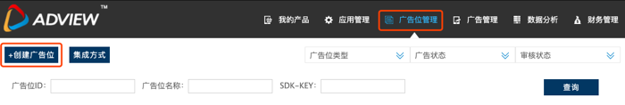
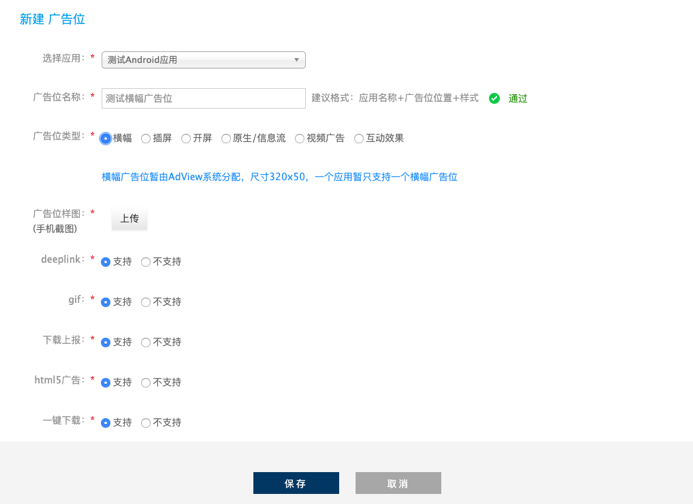

## 注册账号
  访问[AdView](http://www.adview.cn)网站注册帐号;
  在顶部选择应用管理Tab，点击“添加应用”;
  
  填写应用相关信息,请根据需要勾选相应的应用广告形式，否则无法正常获取广告;
  
  选择顶部广告位管理Tab，进入广告位管理界面 选择“创建广告位”;
  
  根据提示选择所属应用，并完善广告位信息，点击下方保存按钮完成广告位创建
  创建完成广告位后，等待审核通过即可获取正式广告
  注：如果需要使用视频或原生广告，需要将生成的广告位ID嵌入到您的代码中
